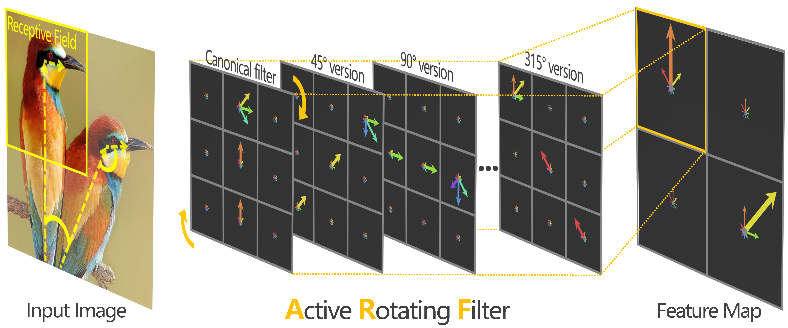
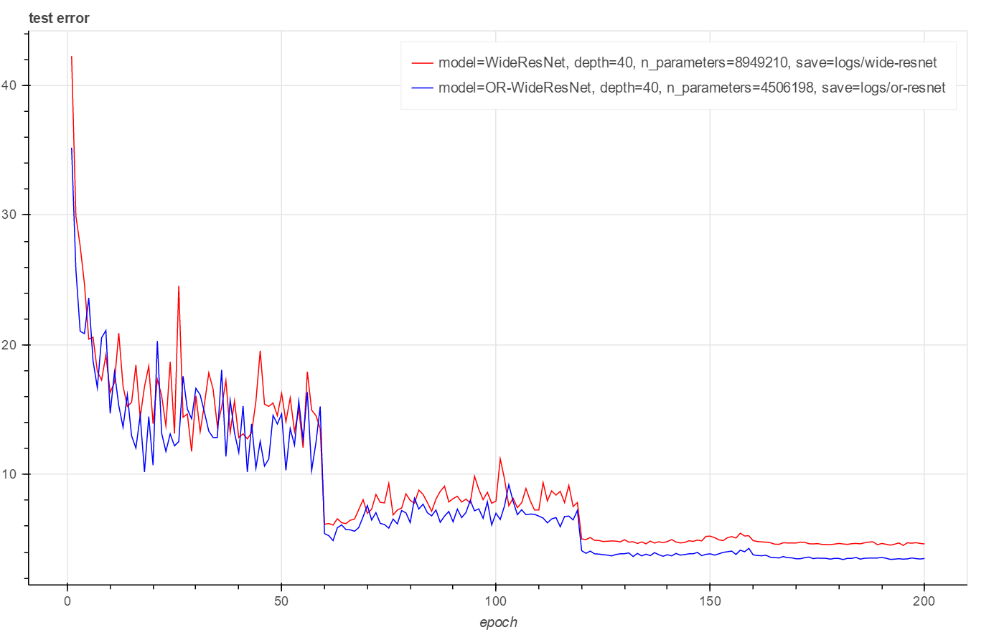

# Oriented Response Networks
[](torch.md) []() []()

[[project]](http://zhouyanzhao.github.io/ORN) [[doc]](http://github.com/ZhouYanzhao/ORN) [[arXiv]](https://arxiv.org/pdf/1701.01833)



## Implementation
### torch 
[[official version 1.0]](torch.md) provides: 
* CPU/GPU/CuDNN version of ORN.
* MNIST-Variants demo, which is also an easy-to-use training framework based on torchnet.  

> CIFAR 

You can train the [OR-WideResNet](https://gist.github.com/ZhouYanzhao/c7f75cd8ea3c92e2044d71ac7bc30fab/raw/or-wrn.lua) model (converted from WideResNet by simply replacing Conv layers with ORConv layers) on CIFAR dataset by using [WRN](https://github.com/szagoruyko/wide-residual-networks).
```bash
dataset=cifar10_original.t7 model=or-wrn widen_factor=4 depth=40 ./scripts/train_cifar.sh
```
With exactly the same settings, ORN-augmented WideResNet achieves state-of-the-art result while using significantly fewer parameters.  

Network          | Params   | CIFAR-10 |
-----------------|:--------:|:--------:
WRN-40-4         | 8.9M     | 4.53
WRN-40-10-dropout| 55.8M    | 3.8
ORN-40-4(1/2)    | **4.5M** | **3.43**

Table.1 Test error (%) on CIFAR10 dataset with flip/translation augmentation and mean/std normalization. (Note that the CIFAR performance of ORN in the paper is based on the ZCA-preprocessed dataset. We will update the arXiv version soon) 



> ImageNet

coming

### caffe 
coming
### pytorch 
coming

## Citation 
If you use the code in your research, please cite:
```bibtex
@INPROCEEDINGS{Zhou2017ORN,
    author = {Zhou, Yanzhao and Ye, Qixiang and Qiu, Qiang and Jiao, Jianbin},
    title = {Oriented Response Networks},
    booktitle = {CVPR},
    year = {2017}
}
```
